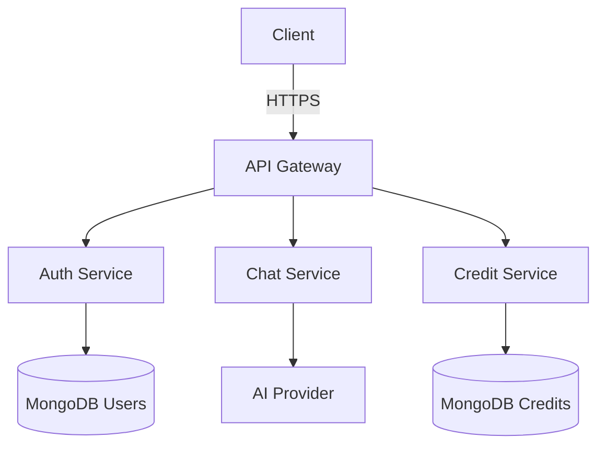
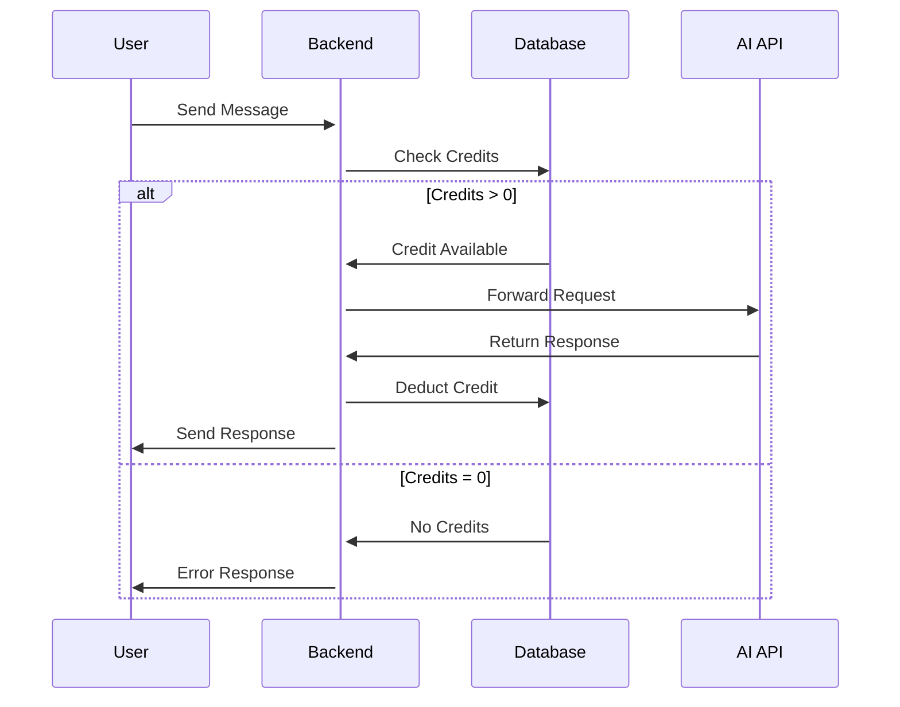

# 🤖 EmoAI ChatBot (MERN + EndGaming AI) [](https://choosealicense.com/licenses/mit/)

An AI-powered chatbot web application built using the MERN stack (MongoDB, Express.js, React.js, Node.js) integrated with the Endgaming AI API. Users can register, log in, and interact with an intelligent chatbot. The app also includes a credit-based system to limit API usage.

---


An AI-powered chatbot web application with emotional intelligence, built using the MERN stack. Features user authentication, credit-based API access, and dynamic response adaptation based on user sentiment.

[](https://react.dev/)
[](https://nodejs.org/)
[](https://www.mongodb.com/)

---

## 🎛️ Table of Contents
- [Key Features](#-key-features)
- [Tech Stack](#-tech-stack)
- [System Architecture](#-system-architecture)
- [Installation](#-installation)
- [Configuration](#-configuration)
- [API Integration](#-api-integration)
- [Credit System](#-credit-system)
- [Security](#-security)
- [Roadmap](#-roadmap)
- [Contributing](#-contributing)
- [License](#-license)
- [Support](#-support)

---

## 🌟 Key Features

| Feature | Description |
|---------|-------------|
| 🧠 **AI-Powered Chat** | Integration with EndGaming AI for intelligent conversations |
| 🔒 **JWT Authentication** | Secure user authentication with token refresh |
| 💳 **Credit System** | Usage-based credit management (1 credit/request) |
| 🎭 **Emotion Adaptation** | Dynamic responses based on detected user mood |
| 📊 **User Analytics** | Track usage patterns and credit consumption |
| ⚡ **Real-Time UI** | Interactive chat interface with React |

### Emotion Response Matrix
| User Emotion | Response Style | Example Response |
|-------------|----------------|------------------|
| 😠 Angry    | Calm + Solution-Oriented | "Let's work through this together..." |
| 😔 Sad      | Empathetic + Encouraging | "I'm here to listen..." |
| 😃 Happy    | Enthusiastic + Playful    | "That's fantastic! 🎉..." |

## 🌈 Emotional Response System

Mood Adaptation Matrix
User Emotion	AI Response Pattern	Sample Response
- 😠 Angry	Calm + Solution-Oriented	"Let's workthrough this..."
- 😔 Sad	Empathetic + Encouraging	"I'm here for you..."
- 😃 Happy	Enthusiastic + Playful	"That's awesome! 🎉..."


---


# 🧠 Core Architecture

## � System Architecture


---

## 🛠 Tech Stack

**Frontend**  


**Backend**  


**Security**  


# ✨ API Usage:
- EndGaming AI API (or you can use other AI API)

### 🔧 Configuration

**Create .env in /backend:**

``` bash
PORT = 4000
MONGO_URI = mongodb://localhost:27017/emoai
JWT_SECRET = your_secure_secret_here
ENDG_API_KEY = your_api_key_here
INITIAL_CREDITS = 10 # Default starting credits
```

### 📡 API Integration
``` bash 
// Example API call to EndGaming AI
app.post('/api/chat', async (req, res) => {
  const { prompt, emotion } = req.body;
  
  const response = await axios.post('https://api.endgaming.ai/v4/)chat', {
    prompt,
    emotion,
    apiKey: process.env.ENDG_API_KEY
  });
res.json(response.data);
});

```
---

# 💳 Credit System
- New users receive 10 free credits
- Credit deduction workflow:




---

# 🚀 Getting Started

## 💫 Installation

**Prerequisites**
- Node.js v18+

- MongoDB v6+

- EndGaming API Key


### 1. Clone the Repository

```bash
git clone https://github.com/201Harsh/AI-CB.git
cd ai-cb
```

### 2. Setup Backend
```bash
cd Backend
npm install
```

- Create a .env file in the server directory:

```bash
PORT=your_Port
MONGO_URI=your_mongodb_connection_string
JWT_SECRET=your_jwt_secret
ENDG_API_KEY=your_endg_api_key
```

- Start the backend:

```bash
npx nodemon
```

### 3. Setup Frontend
```bash
cd Frontend
npm install
npm run dev
```

---

# ✨ Usage
- Register a new user

- Login to your account

- Each user gets initial free credits (configurable)

- Ask a question to the chatbot

- Response is generated via AI API

- Each query consumes credits

---

# 📦 API Integration

#### Using Google Gemini or a similar Google AI API:

- Backend makes POST requests to the API with the user’s prompt

- Response is returned to the frontend

- Credit is deducted per request

---

# 🧮 Credit System (Example)

- Each user starts with 10 credits

- 1 credit = 1 chatbot question

- Credit deduction logic is handled in the backend

- Prevents queries when credits are 0w

---

# 📌 TODOs

- Add UI feedback for no credits

- Add option to purchase or earn more credits

- Improve chatbot UI with typing effect

- Save chat history per user

---

# 🛡️ Security

- Passwords are hashed using bcrypt

- JWT tokens are used for authentication and route protection

- Rate-limiting (optional for production)

---

# 📸 Screenshots

- no Screenshot Availiable

---

# 🗺 Roadmap

- 💸 Credit Purchase System

- 📚 Chat History Storage

- 📊 User Analytics Dashboard

- 🎤 Voice Input Support

- 🌐 Multi-language Support

# 📃 License
- MIT License

## 💬 Acknowledgments

- END Gaming AI API

- MongoDB

- React

- Node.js

- Express

# 🤝 Contributing
Fork the Project

Create your Feature Branch (git checkout -b feature/AmazingFeature)

Commit your Changes (git commit -m 'Add some AmazingFeature')

Push to the Branch (git push origin feature/AmazingFeature)

Open a Pull Request

## 📮 Contact & Support
- Lead Developer: Harsh (@201Harsh)
- GitHub : [201Harsh](https://github.com/201Harsh) | Instagram : [201harshs](https://www.instagram.com/201harshs/)

- Support Portal: support@endgamingai2@gmail.com
---

## Made With ❤️ by Harsh


